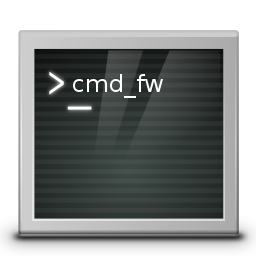

[](../../releases/latest)
[](LICENSE)



# cmd

Contains API related to ```*.cmd``` scripts


## How to use it ?

In the root folder of your script, put a copy of api.cmd.
Then, put this near the top of your script :
```bat
:: compute DIRNAME and BASENAME variables
for /f "tokens=*" %%i in ('echo %0') do set DIRNAME=%%~dpi
if %DIRNAME:~-1%==\ set DIRNAME=%DIRNAME:~0,-1%
for /f "tokens=*" %%i in ('echo %0') do set BASENAME=%%~nxi
```

Now in your code, you can simply use the following syntax :
```bat
call %DIRNAME%\api.cmd :apifunction argument list with %VARIABLE%
```
for example :
```bat
call %DIRNAME%\api.cmd :edebug MYVAR = %MYVAR%
call %DIRNAME%\api.cmd :eexec "echo f | xcopy /hrky sourcefile.exe destfile.exe"
```

